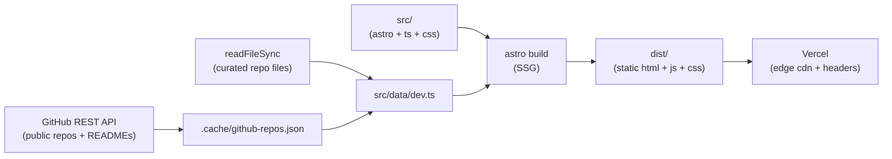
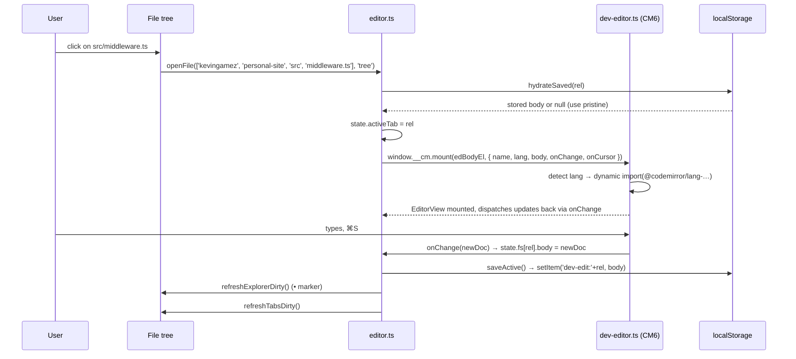

# personal-site

This is the repo behind **kevingamez.co**. A static Astro site with two faces: a calm editorial home (cream + coral, Instrument Serif + Inter Tight + JetBrains Mono, hero with Conway's Game of Life), and a `/dev` page that's basically VS Code in your browser · file tree, terminal, real CodeMirror editor, command palette.

The home is what HR and clients see. `/dev` is what other engineers see. Same person, two registers.

`/dev` loads this exact repo at build time via `fs.readFileSync`, plus my public GitHub repos via the REST API (cached locally so the build still works when the API rate-limits us). Click a file in the tree and you get a real editor with VS Code Dark+ syntax colors, search (⌘F), undo/redo, multi-cursor, save (⌘S → localStorage). The terminal at the bottom is a tiny shell with `ls`/`cd`/`cat`/`tree`/`mkdir`/etc operating on the in-memory FS.

Pure static. No SSR. Deploys on Vercel from `main`. Free tier.

## Table of Contents

- [Pages](#pages)
- [Architecture](#architecture)
  - [What this is NOT](#what-this-is-not)
  - [Build pipeline](#build-pipeline)
  - [Home page](#home-page)
  - [/dev page](#dev-page)
- [Source Code Map](#source-code-map)
  - [Where to make changes](#where-to-make-changes)
- [Tech Stack](#tech-stack)
- [Getting Started](#getting-started)
- [Conventions](#conventions)
- [CI](#ci)
- [Deployment](#deployment)
- [Known gotchas](#known-gotchas)

## Pages

| Route  | Source                     | What it is                                                                                         |
| ------ | -------------------------- | -------------------------------------------------------------------------------------------------- |
| `/`    | `src/pages/index.astro`    | English home. Conway hero, About, Skills, Experience, Work, GitHub stats, Now, Bookshelf, Contact. |
| `/es/` | `src/pages/es/index.astro` | Same as above, in Spanish. Same components, different copy from `src/content/home-es.ts`.          |
| `/dev` | `src/pages/dev.astro`      | VS Code in the browser. CodeMirror editor, file tree, terminal, command palette, status bar.       |
| `/404` | `src/pages/404.astro`      | Themed not-found.                                                                                  |

## Architecture

### What this is NOT

- Not server-rendered. No Node process running anywhere. The whole site is pre-rendered HTML + bundled JS.
- Not a CMS. All copy lives in `src/content/*.ts` as typed objects. Translating is editing two files.
- Not bilingual via i18next or middleware. EN and ES are two distinct routes that import the same components and pass different `t` props.
- Not a real IDE. `/dev` is a static showcase · code edits land in `localStorage`, never in the actual repo. The terminal is a fake shell with a virtual filesystem.

### Build pipeline



The `/dev` page is the only one with build-time data fetching. Frontmatter in `src/pages/dev.astro` calls `buildDevData()` which reads the curated set of project files off disk (so /dev shows the real source) and hits `api.github.com/users/kevingamez/repos`. If the API fails or rate-limits, it falls back to `.cache/github-repos.json` which is gitignored but persisted across local builds.

The data is then serialized to JSON and inlined into the page as `<script id="dev-data" type="application/json">`. Client-side modules read that on init and build the in-memory FS the explorer + shell + editor talk to.

### Home page

Editorial layout. Each section is a component under `src/components/home/`. Section ordering is hard-coded in the page, copy comes from `src/content/home-{en,es}.ts`.

The Conway hero is a `<canvas>` driven by `src/scripts/home/conway.ts` · 64×64 toroidal grid, click to seed, B3/S23 rules, FPS-throttled, respects `prefers-reduced-motion`. The contribution-graph mock under "GitHub" comes from `src/scripts/home/contrib.ts`. Live-ish stats ("commits this month", language breakdown) come from `gh-stats.ts` which calls a tiny build-time helper.

Two image assets matter: `public/kevin.jpg` (the About portrait, 1200×1500, 4:5 cropped via `object-fit: cover`) and `public/og-dev-preview.png` (Open Graph preview, 1200×630, wired in `src/components/Layout.astro`).

### /dev page

This is its own tiny IDE that mimics VS Code's chrome closely. Layout:

```
┌─────────────────────────────────────────────────────────────────┐
│ titlebar (kevin@gamez ~/dev · build a7f3c91)                    │
├─────────────────────────────────────────────────────────────────┤
│ workspace tabs (workspace / scratchpad / changelog)             │
├──┬──────────┬───────────────────────────────────────┬───────────┤
│  │          │ editor tabs (file icons + name)       │           │
│A │ explorer ├───────────────────────────────────────┤  sidebar  │
│B │  tree    │ CodeMirror 6 (vscodeDark + coral)     │  (stats,  │
│  │          │ · liquid glass surface, blur 40px     │   tools,  │
│  │          │                                       │   repos)  │
│  │          ├───────────────────────────────────────┤           │
│  │          │ terminal (zsh / build / tail)         │           │
├──┴──────────┴───────────────────────────────────────┴───────────┤
│ status bar (NORMAL ⎇ main · clean · Ln 6 Col 24)                │
└─────────────────────────────────────────────────────────────────┘
```

What you can do:

| Surface                 | What                                                                                                                                    | How                                                                                                                                                                                                                                       |
| ----------------------- | --------------------------------------------------------------------------------------------------------------------------------------- | ----------------------------------------------------------------------------------------------------------------------------------------------------------------------------------------------------------------------------------------- |
| **Activity bar (left)** | Explorer / Search / Source control / Extensions / Settings                                                                              | Material Symbols icons. Search opens the palette. Other items are visual-only.                                                                                                                                                            |
| **Explorer**            | VS Code-rhythm file tree with PKief Material Icon Theme                                                                                 | 22px rows, 8px-per-level indent, full-width selection, SVG chevrons that rotate on open. Workspace root renders as an uppercase section header.                                                                                           |
| **Editor**              | Real code editor with VS Code Dark+ syntax                                                                                              | CodeMirror 6 with `@uiw/codemirror-theme-vscode` + a coral theme overlay. Languages loaded lazily per file via Compartment. Liquid Glass panel (`backdrop-filter: blur(40px) saturate(180%)`) over an ambient coral/cool radial gradient. |
| **Terminal**            | 3 tabs · `zsh` is a real shell on the in-memory FS, `build:watch` streams a fake Vite log, `tail -f prod.log` streams JSONL access logs | All animated client-side, capped at 200 lines. zsh supports `ls cd cat tree mkdir touch rm rmdir mv echo history clear` + `vim/open` (opens file in editor).                                                                              |
| **Command palette**     | ⌘P fuzzy file search                                                                                                                    | Subsequence match with gap penalty. ↑/↓ navigate, ↵ open, esc close.                                                                                                                                                                      |
| **Tabs**                | File icons + name + close × (becomes ● when dirty)                                                                                      | Icon swap is the same VS Code "modified" pattern.                                                                                                                                                                                         |
| **Save**                | ⌘S persists current file's edits to localStorage                                                                                        | Key: `dev-edit:<path>`. On reload, hydrated back into the editor. Modified marker (●) follows.                                                                                                                                            |

### Open-a-file lifecycle



## Source Code Map

```
src/
├── pages/
│   ├── index.astro             # Home (EN), composes home/* components
│   ├── es/index.astro          # Home (ES)
│   ├── dev.astro               # /dev IDE composition + dev-data injection
│   └── 404.astro
│
├── components/
│   ├── Layout.astro            # <head>, fonts, OG, GA, skip link
│   ├── home/                   # 1 component per home section
│   │   ├── Nav.astro           # Sticky nav with EN/ES toggle, /dev link
│   │   ├── Hero.astro          # Headline + lede + Conway canvas
│   │   ├── About.astro         # Portrait img + prose + quick-facts
│   │   ├── Skills.astro        # Chip clusters (TS, Astro, …)
│   │   ├── Experience.astro    # Timeline
│   │   ├── Work.astro          # Project grid (featured + cards)
│   │   ├── Github.astro        # Stats banner + contribution graph + repo list
│   │   ├── Now.astro           # Building / Reading / Listening / Thinking
│   │   ├── Bookshelf.astro     # 4 book cards
│   │   ├── Contact.astro       # CTA + email + social channels
│   │   └── Footer.astro        # 3-col footer + colophon
│   └── dev/                    # 1 component per /dev pane
│       ├── Titlebar.astro      # window dots + “kevin@gamez ~/dev”
│       ├── ActivityBar.astro   # Left strip with Material Symbols
│       ├── Explorer.astro      # Tree + outline mounts
│       ├── EditorPanel.astro   # .editor wrapper (liquid glass)
│       ├── TerminalPanel.astro # term-tabs + 3 stream containers
│       ├── Workspaces.astro    # Top tabs: workspace / scratchpad / changelog
│       ├── Sidebar.astro       # Right pane: traffic, runtime, reqs, heatmap, repos
│       ├── StatusBar.astro     # Bottom coral strip
│       └── CommandPalette.astro
│
├── content/
│   ├── home.ts                 # Type schema (`HomeStrings`)
│   ├── home-en.ts              # English copy
│   └── home-es.ts              # Spanish copy
│
├── data/
│   ├── dev.ts                  # buildDevData() entry point + serializer
│   ├── dev-files.ts            # readSafe() over a curated list of repo paths
│   └── dev-github.ts           # fetchGithubRepos() + cache read/write
│
├── scripts/                    # All client TS, bundled by Astro/Vite
│   ├── home/
│   │   ├── conway.ts           # Hero canvas
│   │   ├── contrib.ts          # GitHub-style contribution heatmap
│   │   └── gh-stats.ts         # Banner stats wiring
│   ├── dev/                    # The /dev IDE, split per concern
│   │   ├── index.ts            # Bootstraps everything in DOMContentLoaded
│   │   ├── state.ts            # FS, openTabs, activeTab, savedBodies, history
│   │   ├── editor.ts           # Tab strip + CM mount via window.__cm
│   │   ├── explorer.ts         # File tree + outline
│   │   ├── icons.ts            # Material Icon Theme URL mapping
│   │   ├── terminal.ts         # Terminal tab switching + zsh state
│   │   ├── commands.ts         # Shell commands (ls, cd, cat, tree, …)
│   │   ├── workspaces.ts       # Workspace tab switching
│   │   ├── palette.ts          # ⌘P fuzzy file search
│   │   ├── persistence.ts      # localStorage hydration + dirty tracking
│   │   ├── activity-bar.ts     # Left strip click handlers
│   │   ├── highlight.ts        # esc()
│   │   ├── markdown.ts         # md → html for changelog workspace
│   │   ├── fuzzy.ts            # subsequence scoring for palette
│   │   ├── sparkline.ts        # Sidebar traffic spark
│   │   ├── heatmap.ts          # Sidebar contributions heatmap
│   │   ├── request-log.ts      # Sidebar tail-f
│   │   ├── build-stream.ts     # Terminal build:watch animation
│   │   ├── toast.ts            # Save toast
│   │   └── dev-editor-loader.ts# Re-exports CM6 entry
│   ├── dev-editor.ts           # CodeMirror 6 mount → window.__cm.mount/destroy/focus
│   └── lib/
│       ├── analytics.ts        # GA event helper
│       └── logger.ts           # dev-mode console wrapper
│
├── styles/
│   ├── home/                   # 1 css per home component (base, nav, hero, …, footer)
│   └── dev/                    # 1 css per /dev pane (base, chrome, editor, terminal, …)
│
├── lib/                        # Shared typed config (build + runtime)
└── middleware.ts               # Security headers (mirror of vercel.json · dormant on static deploys)
```

### Where to make changes

| Task                     | Files to touch                                                                                                                                           |
| ------------------------ | -------------------------------------------------------------------------------------------------------------------------------------------------------- |
| Edit home copy (EN)      | `src/content/home-en.ts`                                                                                                                                 |
| Edit home copy (ES)      | `src/content/home-es.ts`                                                                                                                                 |
| Add a home section       | New `src/components/home/X.astro` + new key in `home.ts` schema + `home-en.ts` + `home-es.ts` + import in `pages/index.astro` and `pages/es/index.astro` |
| Restyle a home section   | `src/styles/home/<name>.css` (kept in sync 1:1 with components)                                                                                          |
| Add a dev shell command  | `src/scripts/dev/commands.ts` (registry)                                                                                                                 |
| Add a /dev terminal tab  | New stream module under `src/scripts/dev/` + register in `terminal.ts` + tab in `TerminalPanel.astro`                                                    |
| Change editor theme      | `src/scripts/dev-editor.ts` (`coralTheme` + `vscodeDark` import)                                                                                         |
| Change editor surface    | `src/styles/dev/editor.css` (the liquid glass)                                                                                                           |
| Change file-icon mapping | `src/scripts/dev/icons.ts`                                                                                                                               |
| Change indent / chevron  | `src/styles/dev/explorer.css` + `src/scripts/dev/explorer.ts`                                                                                            |
| Add a security header    | **Both** `vercel.json` AND `src/middleware.ts`                                                                                                           |
| New analytics event      | `src/scripts/lib/analytics.ts` (typed)                                                                                                                   |
| OG image                 | `public/og-dev-preview.png` (1200×630) · wired in `src/components/Layout.astro`                                                                          |
| About portrait           | `public/kevin.jpg` (4:5, 1200×1500 recommended)                                                                                                          |
| New env var              | `.env.example` + read in `src/data/*` (build) or expose as `PUBLIC_*` for client                                                                         |

## Tech Stack

| What                  | How                                                                                       |
| --------------------- | ----------------------------------------------------------------------------------------- |
| Static site generator | Astro 5 (no SSR adapter · pure pre-rendered HTML)                                         |
| Editor                | CodeMirror 6 (`@codemirror/{view,state,commands,…}`) + `@uiw/codemirror-theme-vscode`     |
| Lang packages         | `@codemirror/lang-{javascript,markdown,json,css,html,rust}` (lazy-loaded via Compartment) |
| Icons                 | Material Icon Theme (PKief, file/folder icons) + Material Symbols (Google, UI chrome)     |
| Fonts                 | Instrument Serif + Inter Tight + JetBrains Mono + IBM Plex Mono (Google Fonts)            |
| Sitemap               | `@astrojs/sitemap`                                                                        |
| Lint / format         | Prettier + `prettier-plugin-astro`                                                        |
| Type-check            | `astro check` (`@astrojs/check`) · strict TS                                              |
| Tests                 | Playwright smoke (`tests/`) · visits routes, asserts no console errors                    |
| Hosting               | Vercel (static, edge CDN, custom headers in `vercel.json`)                                |
| CI                    | GitHub Actions: `check` + `smoke` + `lighthouse`                                          |

## Getting Started

```bash
git clone https://github.com/kevingamez/personal-site
cd personal-site
npm install
npm run dev
```

Open http://localhost:4321. Hot-reload works for everything except `/dev`'s build-time GitHub fetch (rerun the dev server when the cache invalidates after 24h).

You need Node ≥ 20.

### Commands

```bash
npm run dev            # dev server at localhost:4321
npm run build          # static build to ./dist/
npm run preview        # serve the build locally
npm run check          # astro check (typecheck astro + ts)
npm run format         # prettier --write .
npm run format:check   # prettier --check .
npm test               # playwright smoke
npm run test:install   # one-time: install playwright chromium
```

Run `check` + `format:check` + `build` + `test` before pushing · same gate CI uses.

## Conventions

- **300-line cap per file.** When a page or module pushes past, split it. Pages compose components; long scripts split into modules under `src/scripts/`; long stylesheets split into `src/styles/<area>/*.css`.
- **No inline JS** beyond JSON-LD, GA, and `<script id="dev-data">` carriers. All client logic is bundled via `<script>import '@/scripts/...';</script>`.
- **EN and ES are 1:1 mirrors.** Whenever you add a section, copy key, or component to one, add it to the other in the same commit.
- **`prefers-reduced-motion`** is respected by every animated element (Conway, sparkline, request log, build stream, terminal cursor). Test it.
- **Security headers** live in `vercel.json`. `src/middleware.ts` mirrors them as a fallback for any future SSR adapter · keep both in sync when adding a third-party host.
- **Don't fight the formatter.** Run `npm run format` instead of hand-formatting.
- See `CLAUDE.md` for the Claude-Code-specific notes.

## CI

`.github/workflows/ci.yml` runs three jobs on push/PR to `main`:

| Job            | What                                                                                                                                  |
| -------------- | ------------------------------------------------------------------------------------------------------------------------------------- |
| **check**      | `format:check` → `astro check` → `astro build`                                                                                        |
| **smoke**      | `playwright test` against the built `preview` server. Visits `/`, `/es/`, `/dev`, a 404 · fails on console errors or render breakage. |
| **lighthouse** | `.lighthouserc.json` budgets · performance, a11y, SEO, best-practices. Blocks merges that regress.                                    |

## Deployment

Vercel deploys `main` automatically. Build command: `npm run build`. Output: `dist/`. No SSR adapter · fully pre-rendered.

`vercel.json` configures:

- **Security headers** (CSP, X-Frame-Options, Referrer-Policy, Permissions-Policy) · mirror of `src/middleware.ts`.
- **Immutable cache** for `/_astro/*` (1-year max-age, hash-busted by Astro).
- **Redirects** (none currently · placeholder for future).

Custom domain: `kevingamez.co`. Free tier covers this comfortably.

## Known gotchas

Stuff that bit me. Read before you touch these areas.

**GitHub API**

- Anonymous rate limit is 60 req/hr per IP. The build hits 1 list call + 1 README call per repo (~12 calls). Two builds back-to-back will rate-limit. Workaround: `.cache/github-repos.json` is gitignored but reused across builds. Set `GITHUB_TOKEN` env var to bump the limit to 5000/hr.
- The `/readme` endpoint returns base64 by default. We use `Accept: application/vnd.github.raw` to get plaintext directly.
- `topics` is missing unless you pass `Accept: application/vnd.github+json`. Already set.

**CodeMirror 6**

- Adding a new lang package is async. Mount happens before the lang loads. The Compartment in `dev-editor.ts` reconfigures the lang once it's ready · tests need to wait on idle.
- The `oneDark`/`vscodeDark` themes set their own background. Our liquid-glass panel needs `backgroundColor: 'transparent'` on `&` AND on `.cm-scroller` AND on `.cm-gutters`, otherwise opaque chunks bleed through.
- Search panel inputs need explicit color/background overrides · the default ones go invisible on dark.

**Astro scoped CSS**

- Astro scopes styles by adding `[data-astro-cid-X]` to elements rendered by the template. JS-created elements don't get the attribute, so scoped rules won't match them. Use `<style is:global>` for any selector that targets DOM that JS injects (file tree items, palette items, toast, etc.).

**Dotfiles + `import.meta.glob`**

- Vite's glob `import.meta.glob('/...')` doesn't pick up dotfiles by default. Curated list in `src/data/dev-files.ts` includes them explicitly so `.editorconfig` / `.prettierrc.json` show up in the /dev tree.

**Liquid Glass + backdrop-filter**

- `backdrop-filter` only refracts what's behind the element. If everything behind it is solid black, the effect is invisible. The `.center::before` ambient gradient (coral + cool + violet radial) is what makes the glass actually look like glass.
- Safari needs `-webkit-backdrop-filter` alongside `backdrop-filter`.

**Vercel static + middleware**

- `src/middleware.ts` is dormant on static deploys (only runs with an SSR adapter wired up). Real headers come from `vercel.json`. Don't update one without the other.

## License

Personal project; all rights reserved. Source is public for reference. Ask before reusing the design.
